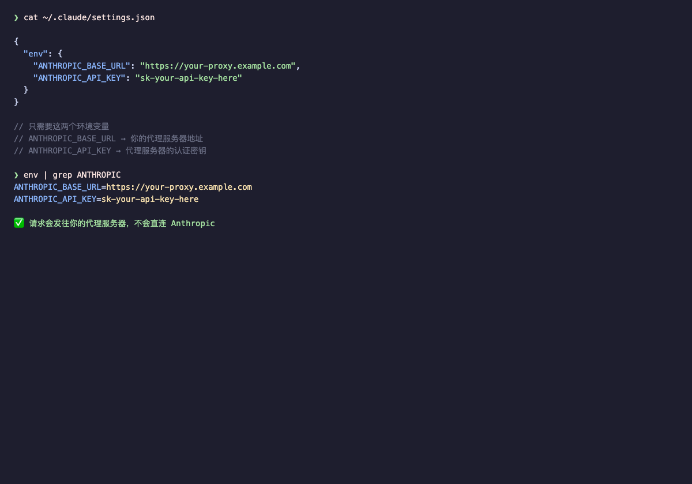
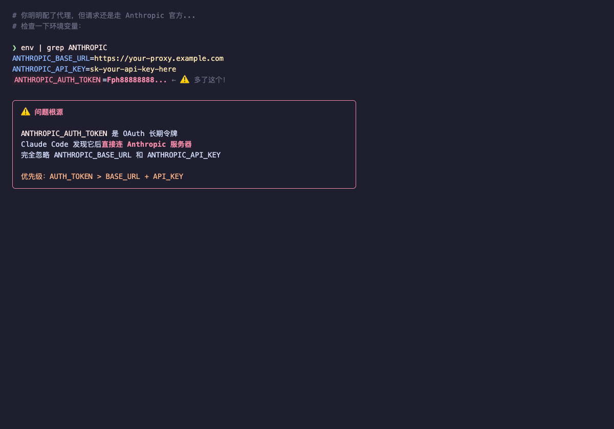
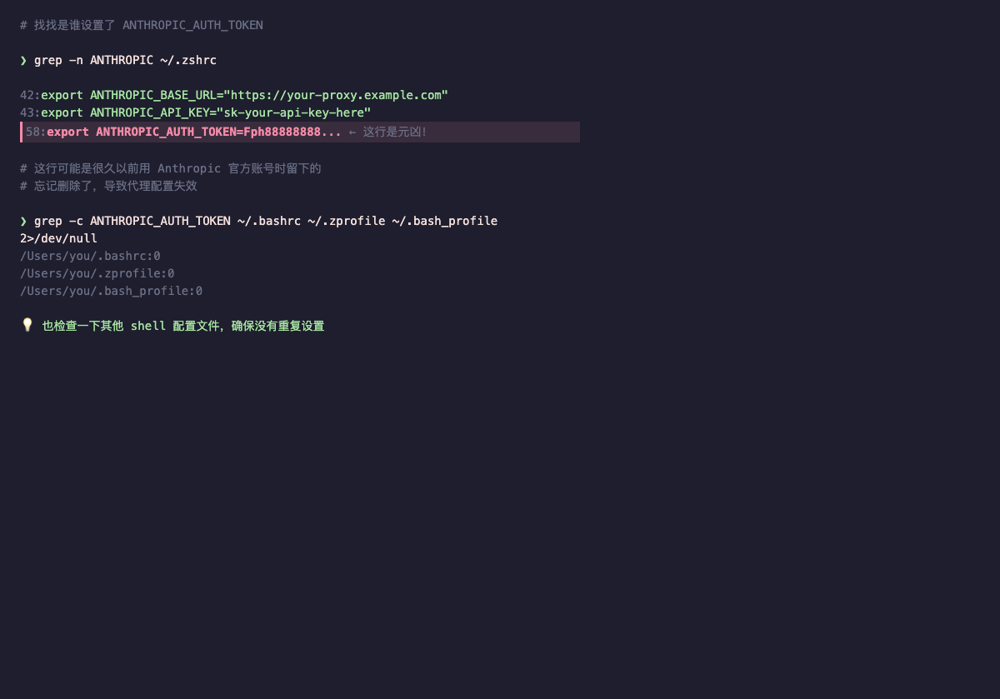
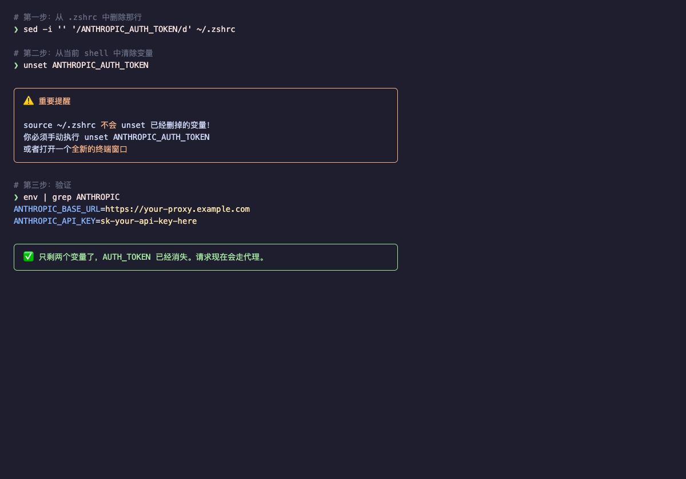
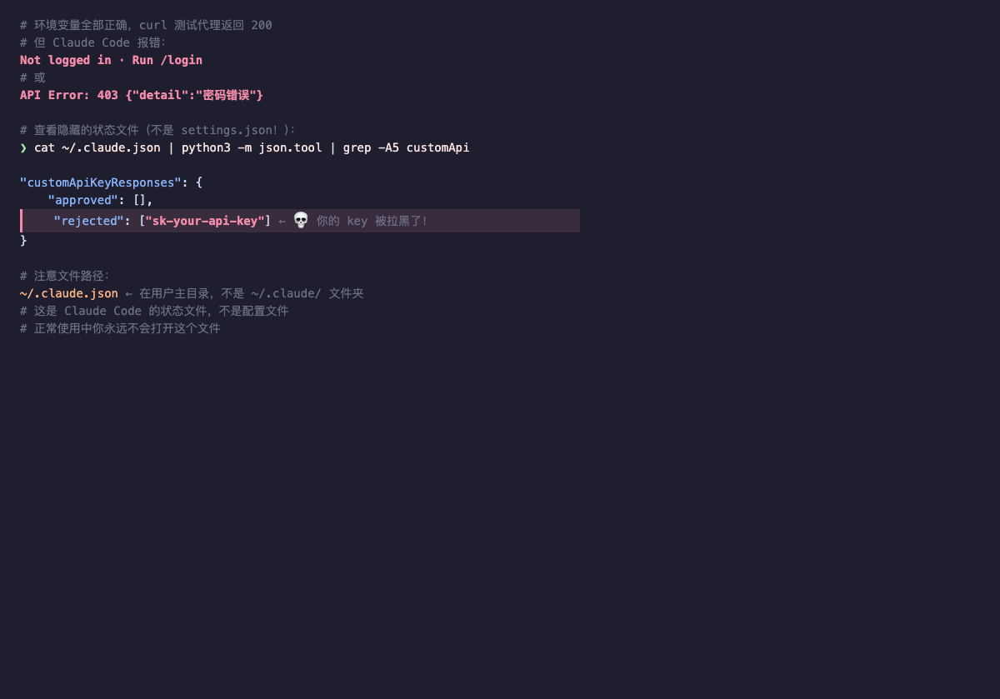
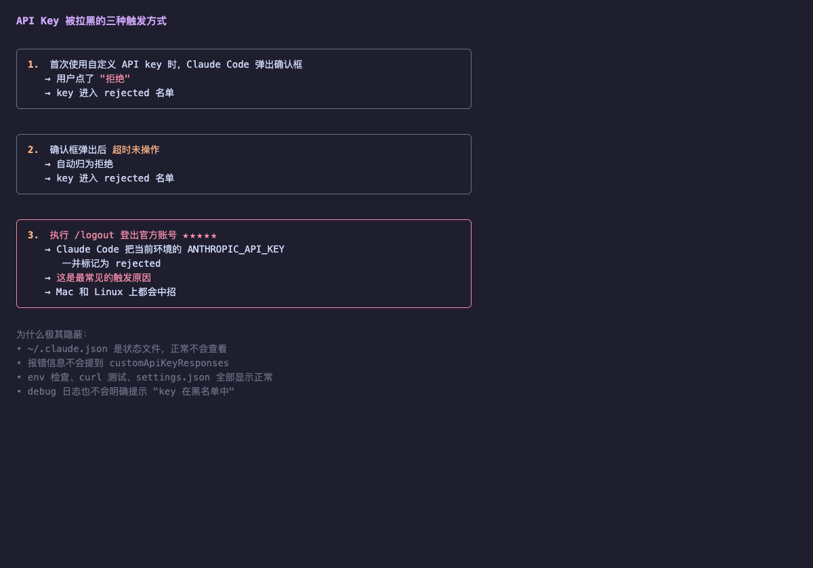
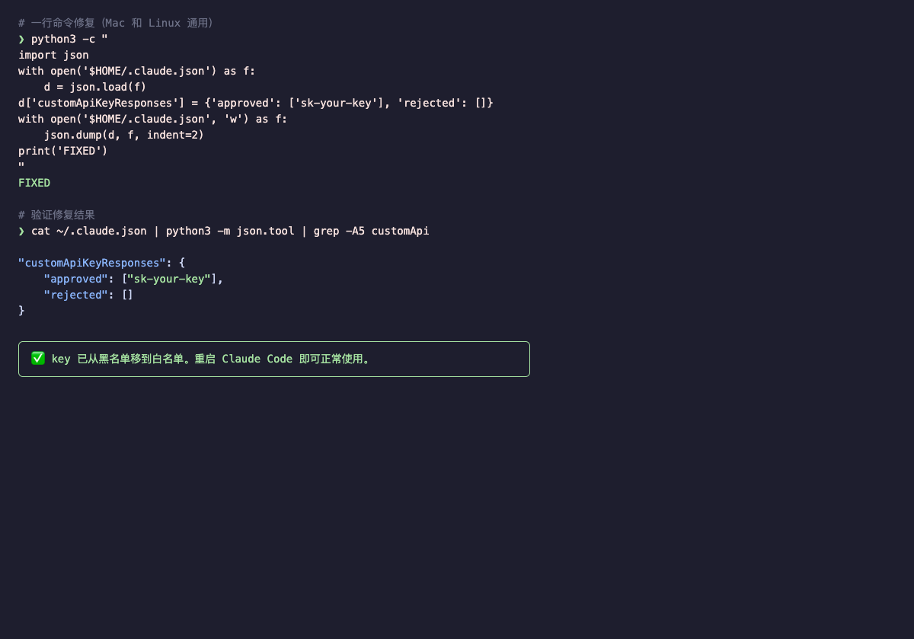
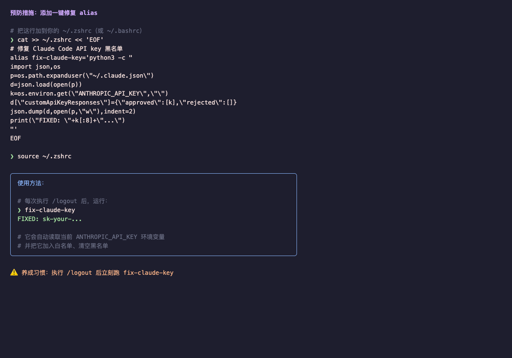

# Claude Code 配置 Codex Proxy 避坑指南

> 当你把 Claude Code 指向 Codex Proxy 却发现它死活不走代理时，这份指南能帮你在 5 分钟内定位并修复问题。

## 前置条件

- Claude Code 已安装并能正常启动
- Codex Proxy 已运行（默认 `http://localhost:8080`）
- 从 Dashboard 获取了 API Key（Settings → API Key）
- 终端（Terminal）的基本使用能力

## 你将学到

- 正确配置 Claude Code 连接 Codex Proxy
- 识别并修复 `ANTHROPIC_AUTH_TOKEN` 导致的代理失效问题
- 识别并修复 `customApiKeyResponses` 导致的 API key 黑名单问题
- 设置预防机制，避免再次踩坑

---

## Step 1: 正确的配置方式

配置 Claude Code 使用 Codex Proxy 只需要两个环境变量。

打开终端，输入以下命令查看你的配置文件：

```bash
cat ~/.claude/settings.json
```

一个正确的配置长这样：



文件中的 `env` 部分设置了两个变量：
- **`ANTHROPIC_BASE_URL`** — Codex Proxy 地址（默认 `http://localhost:8080`）
- **`ANTHROPIC_API_KEY`** — 从 Dashboard 获取的 proxy API key

> **Tip:** Dashboard 的 **Anthropic SDK Setup** 卡片可一键复制所有环境变量（含 Opus / Sonnet / Haiku 层级模型配置）。推荐模型：Opus → `gpt-5.4`，Sonnet → `gpt-5.4-mini`，Haiku → `gpt-5.3-codex`。

如果需要手动创建，在 `~/.claude/settings.json` 中填入：

```json
{
  "env": {
    "ANTHROPIC_BASE_URL": "http://localhost:8080",
    "ANTHROPIC_API_KEY": "your-proxy-api-key",
    "ANTHROPIC_DEFAULT_OPUS_MODEL": "gpt-5.4",
    "ANTHROPIC_DEFAULT_SONNET_MODEL": "gpt-5.4-mini",
    "ANTHROPIC_DEFAULT_HAIKU_MODEL": "gpt-5.3-codex"
  }
}
```

---

## 坑 1：`ANTHROPIC_AUTH_TOKEN` 劫持了你的代理配置

### Step 2: 发现问题——请求不走代理

你明明配好了 `ANTHROPIC_BASE_URL` 和 `ANTHROPIC_API_KEY`，但发现请求还是直接消耗了 Anthropic 官方账号的额度。

在终端输入以下命令，检查所有 ANTHROPIC 相关的环境变量：

```bash
env | grep ANTHROPIC
```



注意看输出：除了你设置的 `ANTHROPIC_BASE_URL` 和 `ANTHROPIC_API_KEY` 之外，多了一个 **`ANTHROPIC_AUTH_TOKEN`**。

这就是问题的根源。`ANTHROPIC_AUTH_TOKEN` 是 Anthropic 官方的 OAuth 长期令牌。Claude Code 发现它之后，会**直接连 Anthropic 服务器**，完全忽略你设置的 `ANTHROPIC_BASE_URL` 和 `ANTHROPIC_API_KEY`。

> **Warning:** `ANTHROPIC_AUTH_TOKEN` 的优先级高于 `ANTHROPIC_BASE_URL` + `ANTHROPIC_API_KEY`。只要它存在，代理配置就形同虚设。

---

### Step 3: 定位来源——找到是哪个文件设置了它

输入以下命令，在你的 shell 配置文件中搜索这个变量：

```bash
grep -n ANTHROPIC ~/.zshrc
```



看到了吗？有一个 `export ANTHROPIC_AUTH_TOKEN=...`。这很可能是你以前使用 Anthropic 官方账号时设置的，后来切换到 Codex Proxy 后忘记删除了。

> **Tip:** 如果在 `~/.zshrc` 中没找到，也检查一下 `~/.bashrc`、`~/.zprofile`、`~/.bash_profile` 这几个文件。

---

### Step 4: 修复——删除残留变量

执行以下两条命令：

```bash
# 第一步：从 .zshrc 中删除包含 ANTHROPIC_AUTH_TOKEN 的行
sed -i '' '/ANTHROPIC_AUTH_TOKEN/d' ~/.zshrc

# 第二步：从当前终端会话中清除这个变量
unset ANTHROPIC_AUTH_TOKEN
```

然后验证修复结果：

```bash
env | grep ANTHROPIC
```



现在只剩下 `ANTHROPIC_BASE_URL` 和 `ANTHROPIC_API_KEY` 两个变量了。

> **Warning:** `source ~/.zshrc` **不会**自动清除已经删除的变量。你必须手动执行 `unset ANTHROPIC_AUTH_TOKEN`，或者关掉当前终端窗口，打开一个全新的。

---

## 坑 2：`customApiKeyResponses` 悄悄把你的 API Key 拉黑了

这个坑比坑 1 更隐蔽、更致命。所有常规排查手段都查不出原因。

### Step 5: 发现问题——一切看起来正确但就是不工作

你的环境变量全部正确，用 `curl` 直接测试 Codex Proxy 也返回 200，但 Claude Code 报错：

- `Not logged in · Run /login`
- 或 `API Error: 403 {"detail":"密码错误"}`

在终端输入以下命令，查看 Claude Code 的隐藏状态文件：

```bash
cat ~/.claude.json | python3 -m json.tool | grep -A5 customApi
```



注意 `rejected` 数组里有你的 API key！Claude Code 启动时会检查这个名单，发现 key 在黑名单中就直接跳过，**根本不发请求**。

> **Warning:** 这个文件是 `~/.claude.json`（在用户主目录下），不是 `~/.claude/settings.json`（在 `.claude` 文件夹里）。两个文件容易搞混。

---

### Step 6: 了解原因——为什么你的 Key 会被拉黑



最常见的触发原因是**第 3 种**：执行 `/logout` 登出 Anthropic 官方账号时，Claude Code 会把当前环境中的 `ANTHROPIC_API_KEY` 一并标记为 rejected。

这个问题极其隐蔽的原因：

- `~/.claude.json` 是状态文件，你平时根本不会打开它
- 报错信息里不会出现 `customApiKeyResponses` 这个字段名
- 所有其他诊断手段（环境变量检查、curl 测试、settings.json 检查）都显示一切正常

---

### Step 7: 修复——将 Key 从黑名单移到白名单

在终端中执行以下命令（把 `your-proxy-api-key` 替换成你的 Codex Proxy API key）：

```bash
python3 -c "
import json
with open('$HOME/.claude.json') as f:
    d = json.load(f)
d['customApiKeyResponses'] = {'approved': ['your-proxy-api-key'], 'rejected': []}
with open('$HOME/.claude.json', 'w') as f:
    json.dump(d, f, indent=2)
print('FIXED')
"
```

然后验证修复结果：

```bash
cat ~/.claude.json | python3 -m json.tool | grep -A5 customApi
```



你的 key 已经从 `rejected` 移到了 `approved`。重启 Claude Code 即可正常使用。

---

### Step 8: 预防——设置一键修复 Alias

为了避免以后每次 `/logout` 都要手动修复，在 `~/.zshrc` 中添加一个快捷命令：

```bash
cat >> ~/.zshrc << 'EOF'
# 修复 Claude Code API key 黑名单
alias fix-claude-key='python3 -c "
import json,os
p=os.path.expanduser(\"~/.claude.json\")
d=json.load(open(p))
k=os.environ.get(\"ANTHROPIC_API_KEY\",\"\")
d[\"customApiKeyResponses\"]={\"approved\":[k],\"rejected\":[]}
json.dump(d,open(p,\"w\"),indent=2)
print(\"FIXED: \"+k[:8]+\"...\")
"'
EOF

source ~/.zshrc
```



以后每次执行 `/logout` 之后，只需要在终端里跑一下 `fix-claude-key`。

> **Warning:** 养成习惯——每次执行 `/logout` 后，立刻跑一次 `fix-claude-key`。

---

## 总结

| 现象 | 检查命令 | 修复方法 |
|------|----------|----------|
| 请求不走代理，直连 Anthropic | `env \| grep ANTHROPIC_AUTH_TOKEN` | 删除并 `unset ANTHROPIC_AUTH_TOKEN` |
| 报 403 或 "Not logged in" | `cat ~/.claude.json \| python3 -m json.tool \| grep -A5 customApi` | 运行 `fix-claude-key` |
| 修改 .zshrc 后变量还在 | `env \| grep ANTHROPIC` | `unset` 变量或开新终端 |
| settings.json 配置不生效 | `cat ~/.claude/settings.json` | 检查 JSON 格式是否正确 |
